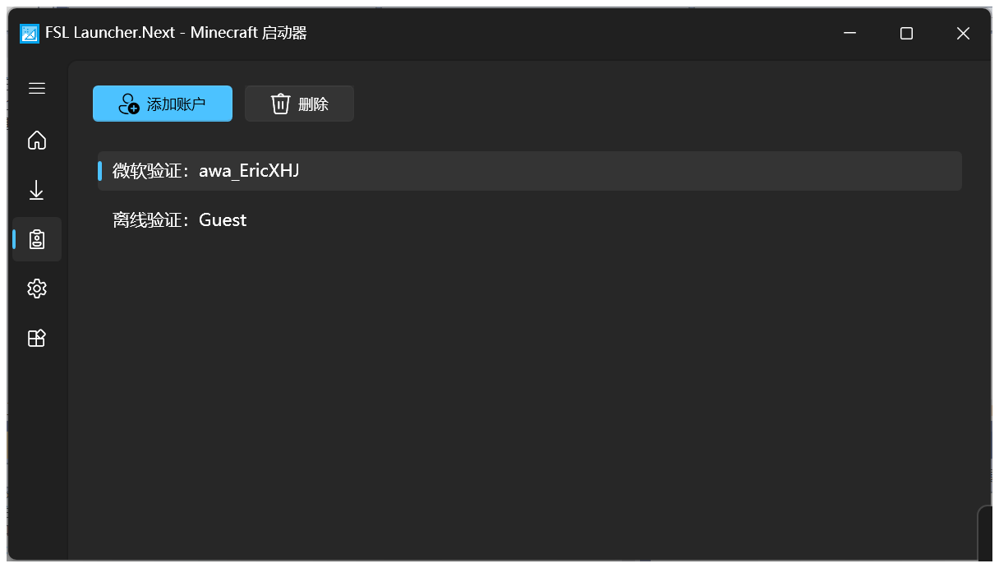
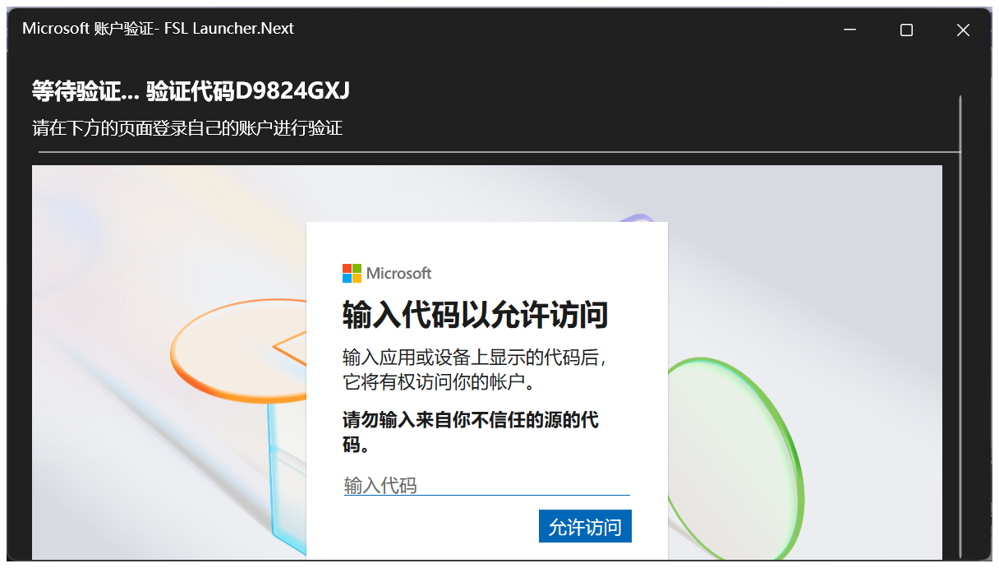
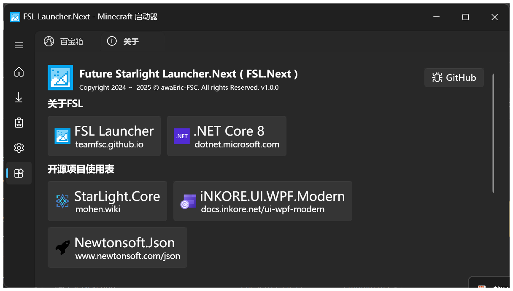
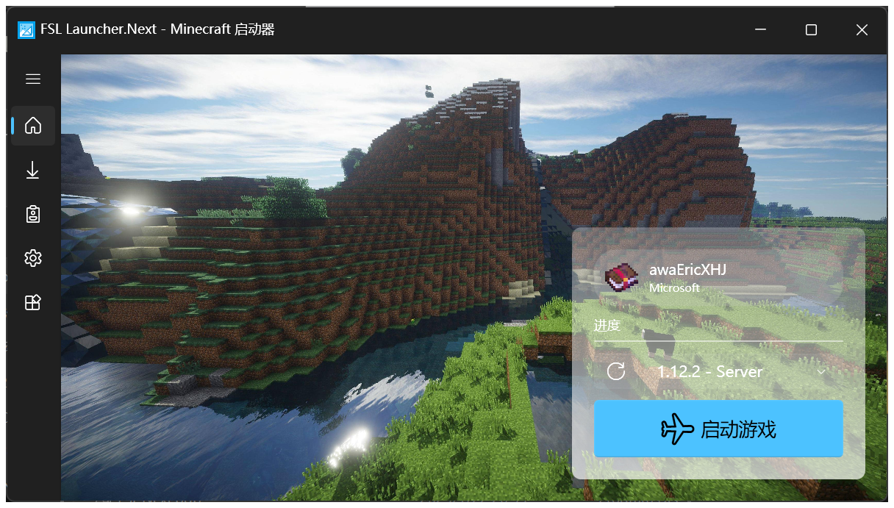
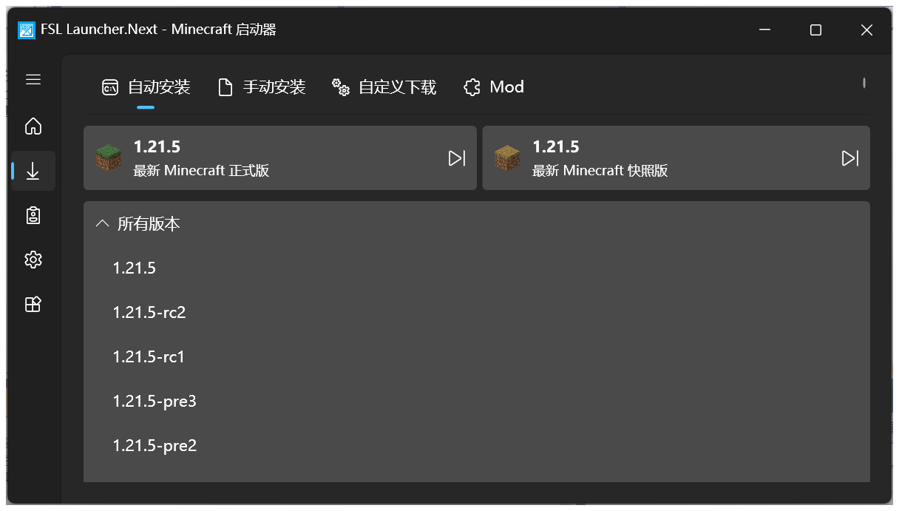
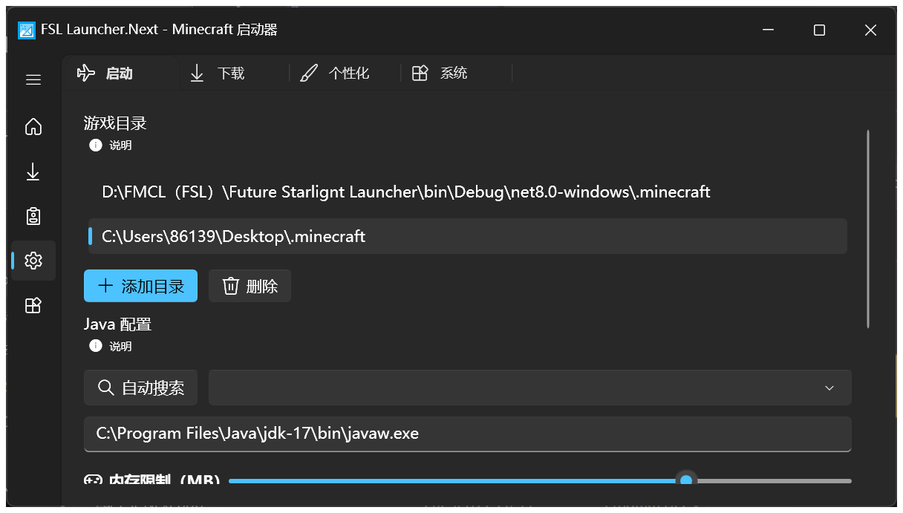

# MCJE - Game Service API Application

::: warning WARNING

This page is about FSL.Next's core program of account system.

If you are just a normal user,**see something else.**

This is actually **NOT** belong to the User Guide.

:::

## What's FSL.Next?

FSL.Next is a Minecraft Launcher coded by CSharp.

## Why to send a application?

We need to use a approved AppID to access Microsoft Authentication.

After that, user can add a Microsoft Account to its launcher.

## How does it work?

Here is the code and comments are translated to English:

```csharp
// LAUNCHER CORE: StarLight.Core (Nuget)

public async void StartMicrosoftAuth()
{
    var msAuth = new MicrosoftAuthentication(" APP_ID ");
    var deviceCodeInfo = await msAuth.RetrieveDeviceCodeInfo();

    browser.Source = new Uri(deviceCodeInfo.VerificationUri);
    loading.Visibility = Visibility.Collapsed;
    browser.Visibility = Visibility.Visible;

    try
    {
        Clipboard.Clear();

        Clipboard.SetText(deviceCodeInfo.UserCode);

        waitingLabel.Content = $"Waiting for authentication... Device Code{deviceCodeInfo.UserCode}";
    }
    catch
    {
        waitingLabel.Content = $"Waiting for authentication... Device Code{deviceCodeInfo.UserCode}";
    }

    var tokenInfo = await msAuth.GetTokenResponse(deviceCodeInfo);


    try
    {
        MicrosoftAccount userInfo;
        userInfo = await msAuth.MicrosoftAuthAsync(tokenInfo, x =>
        {
            waitingLabel.Content = (x);
        });

        waitingLabel.Content = $"Have a great game, {userInfo.Name}";
        await Task.Delay(1000);

        pageFinish.Visibility = Visibility.Visible;
        pageAuth.Visibility = Visibility.Collapsed;
        finishLabel.Content = $"Have a great game, {userInfo.Name}! Please continue in the main window";
        finishSubtitle.Content = "Thank you for support Minecraft, have a great game!";
        
        Accounts.AddMicrosoftAccount(userInfo,(bool)dontSave.IsChecked);
    }
    catch (Exception ex)
    {
        pageFinish.Visibility = Visibility.Visible;
        pageAuth.Visibility = Visibility.Collapsed;
        finishLabel.Content = "Authentication Failed";
        finishSubtitle.Content = "Microsoft Authentication Failed, if you don't have Minecraft Java Edition，please go to Minecraft Website or Microsoft Xbox to buy Minecraft!" + ex.Message;
    }
}
```

```csharp
public async static void AddMicrosoftAccount(MicrosoftAccount userInfo, bool saveFile)
{
    var account = Accounts.accInfos.thisWindow;
    if (!account.accounts.Items.Contains("Microsoft Authentication: " + userInfo.Name))
    {
        account.accounts.Items.Add("Microsoft Authentication: " + userInfo.Name);
        if (!saveFile)
        {
            account.accAdd.IsEnabled = false;
            account.accInfo.Content = "Saving Account Data";

            string text = await File.ReadAllTextAsync("./config/accounts.fsl");
            AccountsList allAccounts = JsonConvert.DeserializeObject<AccountsList>(text);
            List<AccountsDetail> list = allAccounts.Accounts;
            list.Add(new AccountsDetail()
            {
                Type = "Microsoft",
                Microsoft_Name = userInfo.Name,
                Microsoft_Uuid = userInfo.Uuid,
                Microsoft_RefreshToken = userInfo.RefreshToken
            });

            AccountsList accountsList = new()
            {
                Accounts = list
            };
            string json = JsonConvert.SerializeObject(accountsList, Formatting.Indented, new JsonSerializerSettings
            {
                ReferenceLoopHandling = ReferenceLoopHandling.Ignore
            });

            await File.WriteAllTextAsync("./config/accounts.fsl", json);
            account.accInfo.Content = "Completed";
            account.accAdd.IsEnabled = true;
        }
        await Task.Delay(1000);
        account.tips.Visibility = Visibility.Collapsed;
    }
    else
    {
        account.accCannot.Visibility = Visibility.Visible;
    }
}
```

## Gallery

Yeah, only Chinese version :( SORRY!

### Accounts




### Other Pages




